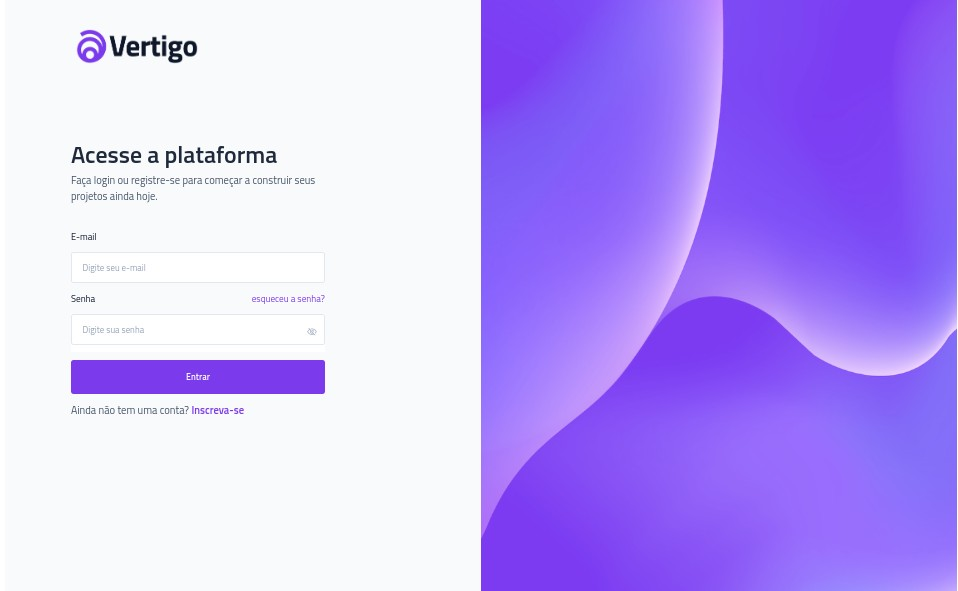

Sure, here's the README.md for the vertigo-login project in the format you requested:

<h1 align="center"> VERTIGO LOGIN </h1>

   The "Vertigo Login" project is a simple web page that demonstrates how to implement a login feature using HTML, CSS, and JavaScript. The page includes a login form where users can enter their username and password to log in. The project also includes validation to ensure that the user has entered a valid username and password. The project is intended as a starting point for building more complex login features in web applications.

  <a href="#-technologies">Technologies</a>&nbsp;&nbsp;&nbsp;|&nbsp;&nbsp;&nbsp;
  <a href="#-project">Project</a>&nbsp;&nbsp;&nbsp;|&nbsp;&nbsp;&nbsp;
  <a href="#-layout">Layout</a>&nbsp;&nbsp;&nbsp;|&nbsp;&nbsp;&nbsp;
  <a href="#memo-license">License</a>

  

   <a href="https://charles-mrt.github.io/vertigo-login/">To access the Vertigo Login page, click here</a>

 

  

## 🚀 Technologies

This project was developed with the following technologies:

- HTML 
- CSS 
- JavaScript 

## 💻 Project

 This project is a simple web page that demonstrates how to implement a login feature using HTML, CSS, and JavaScript. The project includes a login form where users can enter their username and password to log in. The project also includes validation to ensure that the user has entered a valid username and password.

## 🔖 Layout

To test the project you can access through  [THIS LINK](https://charles-mrt.github.io/vertigo-login/)

## memo: Licença

This project is under the MIT license.
---

Made with ♥ by Charles